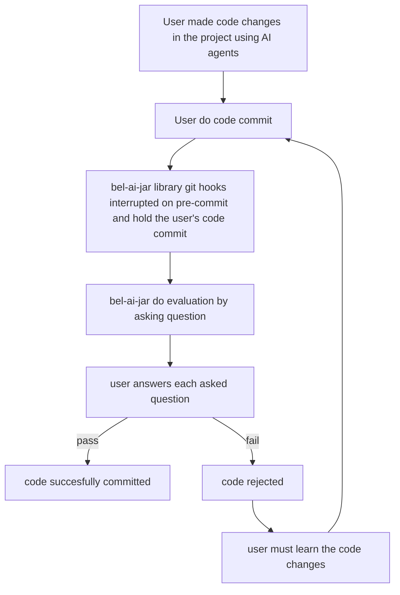

# Bel-ai-jar library agent guide

# Overview

Bel-ai-jar is an open-source library (similar to "husky" that manages git hooks) that helps you to learn what AI agent implemented by asking questions before you commit your code (pre-commit). This is helpful for human to maintain cognitive ability to truly understand what's been implemented by AI agent by reading the changes.

# User stories
## Epic #1: install and configure bel-ai-jar library
| ID | User Story | Priority | Acceptance Criteria |
|----|------------|----------|---------------------|
| US-01-01 | As an user, I want to be able to install "bel-ai-jar" library in my project and there should be a basic guidence on how to install and configure the CLI | P0 | User should be able to install "bel-ai-jar" library in their project |
| US-01-02 | As an user, I want to be able to configure "bel-ai-jar" library by doing "init" command and answering question in my terminal | P0 | User should be asked with question in their terminal on how many question should the "bel-ai-jar" library asked (default 3, minimum 1). User should be asked with question in their terminal on how many options of answer should the "bel-ai-jar" library asked (default 4, minimum 2). User should be asked with question if there is additional prompt that user want to attach to craft the question. User should be asked with question if they want to disable strict-mode (default on), if disabled then user need to set minimum passing grade/percentage (i.e. 50% - half of the questions is correct) |
| US-01-03 | As an user, after I answer all of the question during the installation, the "bel-ai-jar" library should be configured correctly | P0 | All configuration must be stored and loaded by "bel-ai-jar"  |
| US-01-04 | As an user, I should be able to see all available documentation and command through -help command | P0 | A quick documentation of the library and available command should be accessible by user through terminal  |
| US-01-05 | As an user, if I want to disable "bel-ai-jar" library I can run a simple disable command in the terminal | P1 | All configuration must be stored and loaded by "bel-ai-jar"  |
| US-01-06 | As an user, if I want to enhance the "bel-ai-jar" library question generation, I should be able to configure an additional prompt through terminal | P1 | "bel-ai-jar" library should asked addtional prompt (default none) during installation and a command to add additonal prompt even after the installation stage |
| US-01-07 | As an user, I should be able to configure which AI models to be used for question generation | P0 | "bel-ai-jar" library should asked AI model API key during installation, for now only integrate with Mistral API |

## Epic #2: evaluation
| ID | User Story | Priority | Acceptance Criteria |
|----|------------|----------|---------------------|
| US-02-01 | As an user, once I have finished working on my code changes using AI agents and wanted to commit my code (co-authored by AI agent), there should be a git hooks of pre-commit that going to asked my a questions related to the changes implemented by the AI agent (evaluation stage). If I fail answering the questions and not passing the passing grade/percentage then commit will fail, otherwise commit should go through | P0 | User should be able to see question on each pre-commit |
| US-02-02 | As an user, during the evaluation stage, I should see a question and multiple choice of options that I can choose through terminal (one of the option must be correct) | P0 | User should be able to see question and choose answer based on the options through terminal |

# Functional requirements
## Evaluation generation module
| Req ID | Requirement | Priority | Notes |
|--------|-------------|----------|-------|
| FR-01-01 | System should be able to generate questions using AI based on the code changes (co-authored by AI agents) | P0 | Question generation |
| FR-01-02 | System should be able to generate multiple choice of options (4 options, 1 option must be correct) using AI based on the generated questions | P0 | Answers generation |

## Configuration module
| Req ID | Requirement | Priority | Notes |
|--------|-------------|----------|-------|
| FR-02-01 | System shall store all configuration in a file stored in the project for the user to interact and manage directly if needed |

# Non-Functional requirements
## performance requirements
| Req ID | Requirement | Target | Measurement |
|--------|-------------|--------|-------------|
| NFR-01-01 | Small module size | < 5 mb | total library size |

## security requirements
| Req ID | Requirement | Target | Measurement |
|--------|-------------|--------|-------------|
| NFR-02-01 | All data transmission shall use TLS 1.3 encryption | P0 | In-transit encryption |

## testing requirements
| Req ID | Requirement | Target | Measurement |
|--------|-------------|--------|-------------|
| NFR-03-01 | unit test must be implemented with high coverage | > 95% | code coverage |

# User flow
## Installation and Configuration flow
```mermaid
flowchart TD
    A1[Install bel-ai-jar library] --> A2[Configure bel-ai-jar using terminal]
    A2 --> A3[Configure total number of question]
    A3 --> A4[Configure number of answer options on each question]
    A4 --> A5[Configure passing grade]
    A5 --> A6[Configure additional prompt to enhance question generation (default none)]
```

## Evaluation and git hooks flow


# Configuration model
| Field | Default | Description |
|-------|---------|-------------|
| total_number_of_question | 3 | Number of question asked to the user (default 3, minimum 1, maximum 10) |
| passing_grade | 100% | Yes | How many question should be answered |
| number_of_answer_option | 4 | Number of answer options available for each question (default 4, minimum 2, maximum 8) |
| additional_prompt | Prompt from user to enhance the questions generation |

# Technical stack
- Python 3
- UV as package manager

# Code Style Guidelines
## General Principles
- Maintain clean, readable, and consistent code
- Prevent repeating code and optimize for re-usablility (dont repeat yourself principles)
- Keep methods small and focused on a single task
- Use type hints where appropriate
- Write unit tests for new functionality

## Comments
- Write comments in English only
- Add comments only when necessary to explain complex logic
- Don't comment obvious code
- Use docstrings for classes and public methods

## Naming Conventions
- Use descriptive names for classes, methods, and variables
- Follow Python naming conventions:
  - snake_case for methods and variables
  - CamelCase for classes
  - UPPER_CASE for constants