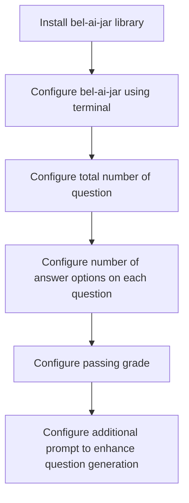
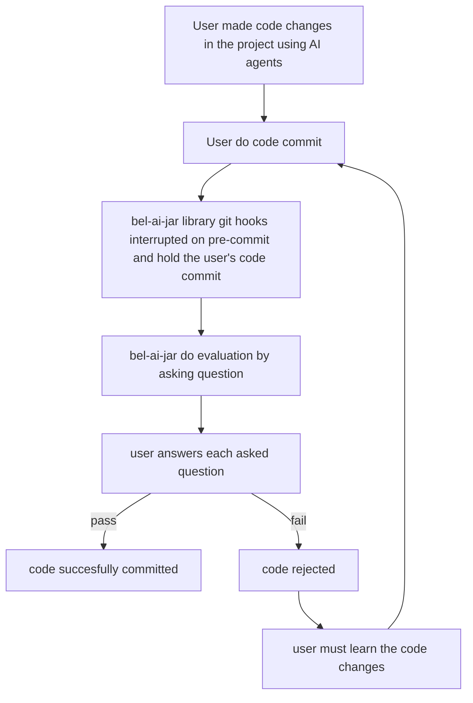

# bel-ai-jar

Git hooks for understanding AI-generated code changes.

## Problem

When working with AI-generated code, developers often face the challenge of understanding the changes made by AI agents. This can lead to a lack of cognitive understanding and ownership of the code, making it difficult to maintain and debug in the future.

## Solution

Bel-ai-jar is an open-source library that helps developers understand AI-generated code changes by asking questions before committing the code. This ensures that developers truly understand what has been implemented by the AI agent, maintaining cognitive ability and ownership of the code.

## User Flow

### Installation and Configuration Flow



### Evaluation and Git Hooks Flow



## Architecture Flow

1. When you run `git commit`, the pre-commit hook will trigger.
2. Bel-ai-jar analyzes your staged changes.
3. It generates questions about the code changes using AI.
4. You answer the questions.
5. If you pass the evaluation, your commit proceeds.
6. If you fail, you need to review the changes and try again.

## Tech Stack

- **Python > 3.8**: Primary programming language.
- **Mistral Vibe**: AI framework used for generating questions and evaluating answers.
- **Mistral Devstral-2**: AI model used for question generation and evaluation.

## Installation

```bash
pip install bel-ai-jar
```

## Usage

### Initialize Configuration

```bash
bel-ai-jar init
```

This will guide you through setting up:
- Number of questions to ask (default: 3)
- Number of answer options per question (default: 4)
- Strict mode (default: enabled)
- Passing grade (if strict mode disabled)
- Additional prompt for question generation

### Disable bel-ai-jar

```bash
bel-ai-jar disable
```

## Configuration

Configuration is stored in `.bel-ai-jar.json` in your project root.

## Development

```bash
# Install in development mode
pip install -e .

# Run tests
python -m pytest
```