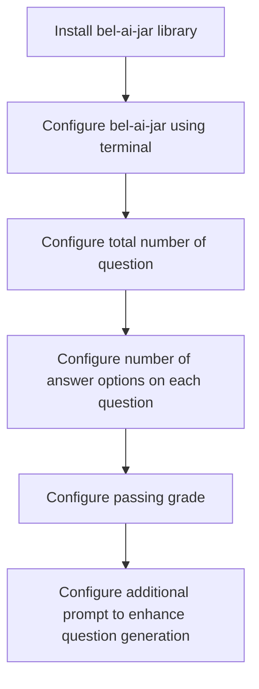
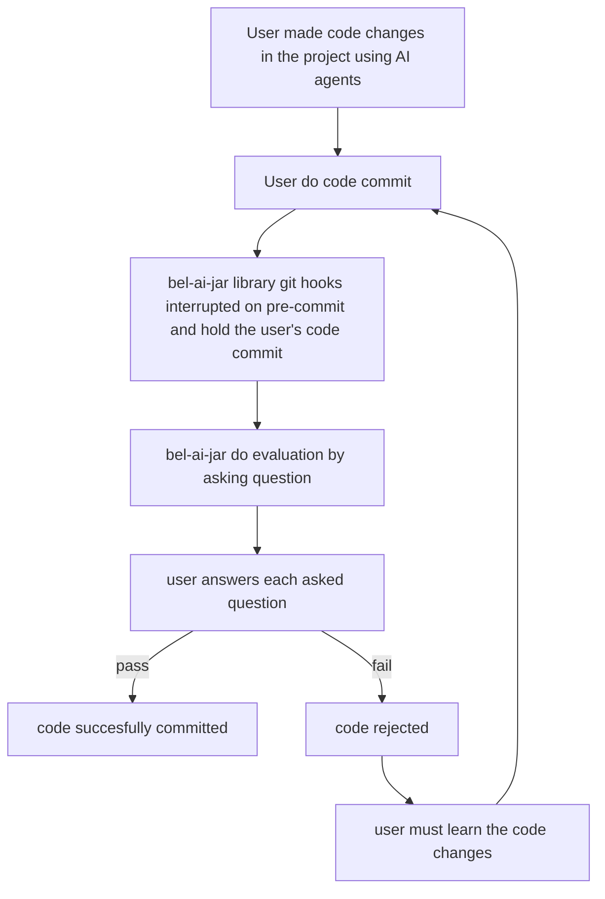

<p align="center">
  
</p>

<h1 align="center">bel-ai-jar</h1>

<p align="center">
  Git hooks for understanding AI-generated code changes.
</p>

<p align="center">
  <a href="https://pypi.org/project/bel-ai-jar/"></a>
  <a href="https://www.npmjs.com/package/bel-ai-jar"></a>
  <a href="https://pypi.org/project/bel-ai-jar/"></a>
  
  <a href="LICENSE"></a>
  <a href="https://github.com/ichwanhs96/bel-ai-jar/issues"></a>
</p>

---

## Problem

When working with AI-generated code, developers often face the challenge of understanding the changes made by AI agents. This can lead to a lack of cognitive understanding and ownership of the code, making it difficult to maintain and debug in the future.

## Solution

Bel-ai-jar is an open-source library that helps developers understand AI-generated code changes by asking questions before committing the code. This ensures that developers truly understand what has been implemented by the AI agent, maintaining cognitive ability and ownership of the code.

## User Flow

### Installation and Configuration Flow



### Evaluation and Git Hooks Flow



## Architecture Flow

1. When you run `git commit`, the pre-commit hook will trigger.
2. Bel-ai-jar analyzes your staged changes.
3. It generates questions about the code changes using AI.
4. You answer the questions.
5. If you pass the evaluation, your commit proceeds.
6. If you fail, you need to review the changes and try again.

## Tech Stack

- **Python ≥ 3.8** / **Node.js ≥ 16**: Supported runtimes.
- **Mistral / OpenAI / Local Llama**: Pluggable AI backends for question generation.

---

## Installation

### Python (pip)

```bash
pip install bel-ai-jar
```

### JavaScript (npm)

```bash
npm install -g bel-ai-jar
```

---

## Usage

### Initialize Configuration

**Python:**
```bash
bel-ai-jar init
```

**JavaScript:**
```bash
bel-ai-jar init
```

This will guide you through setting up:
- Number of questions to ask (default: 3)
- Number of answer options per question (default: 4)
- AI model selection (Mistral, OpenAI GPT-3.5/4, or Local Llama)
- Strict mode (default: enabled — must answer all questions correctly)
- Passing grade (if strict mode disabled)
- Additional prompt for question generation

### Disable bel-ai-jar

```bash
bel-ai-jar disable
```

---

## Configuration

Configuration is stored in `.bel-ai-jar.json` in your project root. This file is automatically added to `.gitignore` during `init`.

### Security: API Keys

**API keys are never stored in the config file.**

Set your API key as an environment variable before running `bel-ai-jar init`:

```bash
# Mistral
export MISTRAL_API_KEY='your-mistral-api-key'

# OpenAI
export OPENAI_API_KEY='your-openai-api-key'
```

Add the export to your shell profile (`~/.zshrc`, `~/.bashrc`, etc.) to persist it across sessions. bel-ai-jar will automatically read the key from the environment at runtime.

---

## Development

### Python

```bash
cd src/python

# Install in development mode (includes test dependencies)
pip install -e ".[dev]"

# Run tests
python -m pytest
```

### JavaScript

```bash
cd src/javascript
npm install

# Run tests
npm test
```

---

## Repository Structure

```
bel-ai-jar/
├── src/
│   ├── python/           # Python package (pip)
│   │   ├── bel_ai_jar/   # Source code
│   │   ├── tests/        # Pytest tests
│   │   └── pyproject.toml
│   └── javascript/       # JavaScript package (npm)
│       ├── src/          # Source code
│       ├── tests/        # Jest tests
│       └── package.json
├── documentation/
├── logo.webp
└── README.md
```

---

## Publishing

### PyPI

```bash
cd src/python
pip install build twine
python -m build
twine upload dist/*
```

### npm

```bash
cd src/javascript
npm publish
```

---

## Contributing

Contributions are welcome! Please open an issue or submit a pull request on [GitHub](https://github.com/ichwanhs96/bel-ai-jar).

1. Fork the repository
2. Create your feature branch (`git checkout -b feature/amazing-feature`)
3. Commit your changes (guided by bel-ai-jar itself 😄)
4. Push to the branch (`git push origin feature/amazing-feature`)
5. Open a Pull Request
